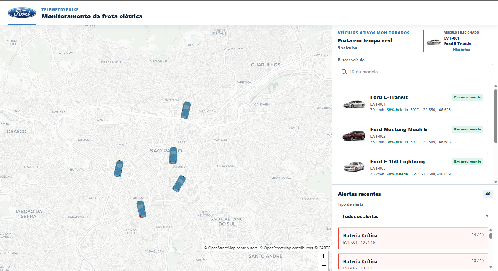
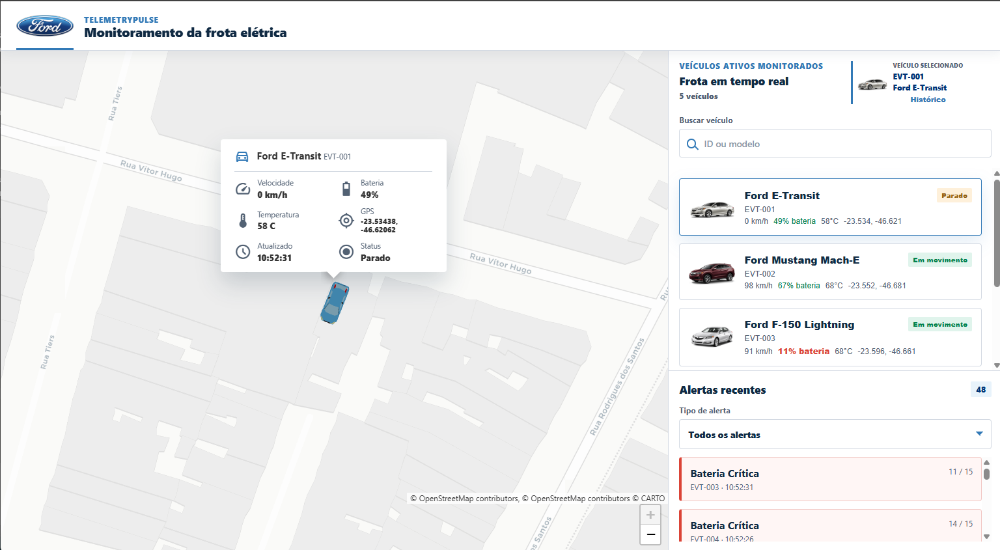
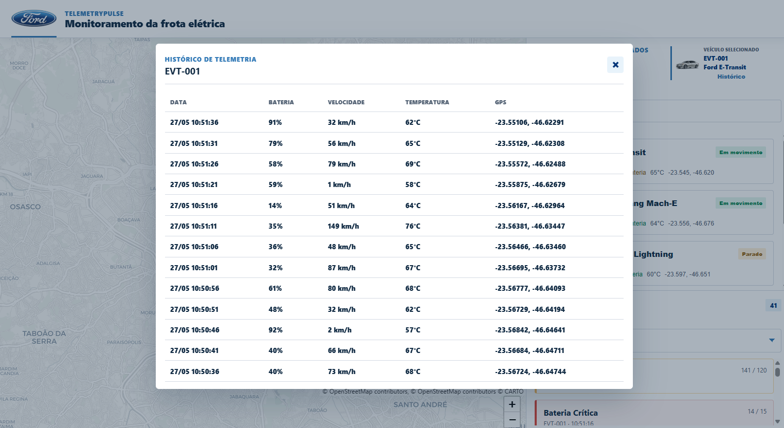

# TelemetryPulse

Monorepo para monitoramento em tempo real de uma frota de veiculos eletricos.

O projeto implementa ingestao de telemetria, processamento de alertas, persistencia historica e um dashboard Angular reativo com mapa, lista de veiculos, alertas recentes, historico e visualizacao 3D dos veiculos sobre um mapa gratuito.

## Demonstracao

Video: [TelemetryPulse - demonstracao do dashboard](https://youtu.be/6XC-aX-9Smk)







## Decisoes principais

- Monorepo com Nx, separando `apps/` e `libs/`.
- Frontend em Angular 21 com componentes standalone, RxJS e `ChangeDetectionStrategy.OnPush`.
- Backend em Java 21 com Spring Boot 4, JPA, H2 local e suporte a Postgres via Docker.
- Streaming em tempo real via SSE em `GET /api/stream`.
- Mapa gratuito com Leaflet, CartoDB Positron e OpenStreetMap.
- Visualizacao 3D dos veiculos com modelo GLB renderizado em camada Three.js sobre o mapa.
- Biblioteca `shared-ui` com componentes reutilizaveis de interface.
- Biblioteca `shared-contracts` com tipos TypeScript, labels centralizados e OpenAPI.

## Referencia visual

A interface foi inspirada no estudo publico [Ford Pro Design System, de Chris Kennedy](https://www.chriskennedydesigns.com/ford). Essa referencia foi usada apenas como base conceitual para simular um fluxo real de desenvolvimento com design system: tokens visuais, campos de busca, dropdowns, cards, lista de veiculos e componentes reutilizaveis.

Esse projeto nao usa, nao distribui e nao representa um design system oficial da Ford.

## Estrutura

```text
telemetrypulse-monorepo/
|-- apps/
|   |-- fleet-dashboard/          # Angular dashboard
|   `-- telemetry-processor/      # Spring Boot backend
|-- libs/
|   |-- shared-ui/                # Componentes Angular reutilizaveis
|   `-- shared-contracts/         # Tipos e contrato OpenAPI
|-- docs/images/                  # Prints usados na documentacao
|-- infra/nginx/                  # Configuracao do frontend em Docker
|-- scripts/                      # Scripts auxiliares para ambiente local
|-- docker-compose.yml
|-- nx.json
`-- README.md
```

## Pre-requisitos

Para rodar localmente:

- Node.js 22 ou superior.
- npm 10 ou superior.
- Java 21.

Opcional:

- Docker e Docker Compose para subir frontend, backend e Postgres juntos.

No Windows, se houver mais de uma versao de Java instalada, garanta que o terminal esteja usando Java 21:

```powershell
$env:JAVA_HOME="C:\Program Files\Java\jdk-21"
$env:Path="$env:JAVA_HOME\bin;$env:Path"
java -version
```

## Instalacao

Depois de clonar o repositorio:

```powershell
cd telemetrypulse-monorepo
npm ci
```

O backend usa Maven Wrapper, entao nao e necessario instalar Maven globalmente.

## Rodando localmente

### Caminho recomendado no Windows

Subir backend e frontend em terminais separados automaticamente:

```powershell
npm run start:local
```

URLs:

- Dashboard: http://localhost:4200
- Backend health: http://localhost:8080/actuator/health
- H2 console: http://localhost:8080/h2-console

### Rodar em dois terminais

Terminal 1, backend:

```powershell
npm run start:backend
```

Terminal 2, frontend:

```powershell
npm run start:frontend
```

Tambem e possivel usar o atalho padrao apenas para o frontend:

```powershell
npm start
```

### Comandos diretos

Backend no Windows:

```powershell
cd apps\telemetry-processor
.\mvnw.cmd spring-boot:run
```

Backend no Linux/macOS:

```bash
cd apps/telemetry-processor
./mvnw spring-boot:run
```

Frontend:

```powershell
npx nx serve fleet-dashboard --port 4200
```

Se quiser trocar a porta do frontend:

```powershell
npx nx serve fleet-dashboard --port 4020
```

## Rodando com Docker

```powershell
docker compose up --build
```

Servicos:

- Frontend: http://localhost:4200
- Backend: http://localhost:8080
- Postgres: `localhost:5432`

O `docker-compose.yml` usa Postgres 16 e configura o backend para usar o banco via variaveis de ambiente.

## Funcionamento do mock

O backend inicia um gerador de telemetria mockado, habilitado por padrao:

```properties
telemetry.mock.enabled=true
telemetry.mock.fixed-rate-ms=5000
```

A cada 5 segundos ele atualiza cinco veiculos simulados em Sao Paulo, persiste a telemetria, recalcula o status atual e publica eventos SSE para o frontend.

## Regras de alerta

- Velocidade maior que `120 km/h`: alerta `SPEEDING` com mensagem "Excesso de Velocidade".
- Bateria abaixo de `15%`: alerta `CRITICAL_BATTERY` com mensagem "Bateria Critica".

## API principal

- `POST /api/telemetry`: ingere uma leitura de telemetria.
- `GET /api/stream`: stream SSE com eventos `SNAPSHOT`, `TELEMETRY`, `ALERT` e `HEARTBEAT`.
- `GET /api/vehicles`: lista o status atual dos veiculos.
- `GET /api/alerts/recent`: lista os 50 alertas mais recentes.
- `GET /api/telemetry/{vehicleId}?from=...&to=...`: historico por veiculo e periodo.

Exemplo de ingestao manual:

```powershell
Invoke-RestMethod -Method Post http://localhost:8080/api/telemetry `
  -ContentType 'application/json' `
  -Body '{
    "vehicleId": "EVT-999",
    "model": "Ford E-Transit",
    "imageUrl": "/vehicles/sedan-silver.png",
    "batteryLevel": 12,
    "speedKmh": 132,
    "motorTemperatureCelsius": 74,
    "latitude": -23.5617,
    "longitude": -46.6559
  }'
```

## Testes e qualidade

Rodar tudo:

```powershell
npm run test
npm run build
npm run lint
```

Rodar apenas frontend:

```powershell
npx nx test fleet-dashboard
npx nx test shared-ui
npx nx build fleet-dashboard
```

Rodar apenas backend:

```powershell
npx nx test telemetry-processor
npx nx build telemetry-processor
```

Cobertura atual:

- Frontend `fleet-dashboard`: testes de reducer RxJS (`snapshot`, upsert de telemetria, deduplicacao e limite de alertas), contrato HTTP/EventSource do `FleetTelemetryService`, view model do dashboard e modal de historico.
- Biblioteca `shared-ui`: testes unitarios dos componentes reutilizaveis, cobrindo emissao de eventos, labels de status e estados visuais.
- Backend `telemetry-processor`: testes unitarios do `TelemetryProcessingService` com mocks de repositorio/SSE, cobrindo regras de alerta, limites, ordenacao, status offline e historico.
- Integracao backend: teste HTTP com banco H2 em memoria cobrindo ingestao, validacao de payload, geracao de alertas, consulta de veiculos, alertas recentes, historico e abertura do stream SSE.

## Pontos interessantes da implementacao

- O dashboard consome SSE e reduz o estado com RxJS, evitando refresh manual.
- O mapa usa uma stack gratuita: Leaflet + CartoDB Positron/OpenStreetMap.
- A camada 3D usa Three.js com lazy loading, mantendo o bundle inicial menor.
- O modelo GLB do veiculo se move sobre o mapa, criando uma visualizacao mais rica do que um marcador estatico.
- A `shared-ui` separa componentes reutilizaveis como busca, select e item de veiculo.
- Os textos de status e alertas ficam centralizados em `shared-contracts`, facilitando manutencao e evolucao para i18n.

## Possiveis evolucoes

- Extrair a logica 3D do `FleetMapComponent` para um servico dedicado, por exemplo `Vehicle3dOverlayService`.
- Extrair a montagem de popup para um componente/template Angular em vez de string HTML.
- Criar testes de contrato para validar o OpenAPI contra os DTOs reais.
- Adicionar teste end-to-end com Playwright para validar fluxo real no navegador: receber telemetria, clicar em veiculo, abrir popup, abrir historico e filtrar alertas.
- Adicionar Testcontainers para testar Postgres real no backend.
- Criar profiles separados para `local`, `test` e `docker`.
